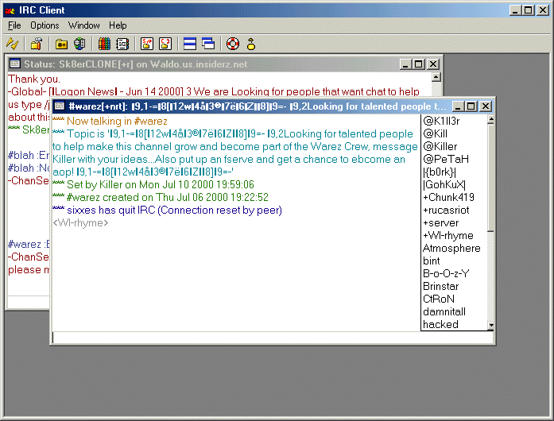



## mIRC clone, IRC client

### Description

This is an updated copy of my Client I submitted a couple days ago, I still didn't add colors yet, but I stared on DCC, if your still intrested in helping, my ICQ# is 52567840... This will be a complete mIRC clone when I am done...
 
### More Info
 

             |
---                |---
**Submitted On**   |2000-07-12 23:55:28
**By**             |[Wanna\-Sk8er](https://github.com/Planet-Source-Code/PSCIndex/blob/master/ByAuthor/wanna-sk8er.md)
**Level**          |Advanced
**User Rating**    |4.6 (115 globes from 25 users)
**Compatibility**  |VB 3\.0, VB 4\.0 \(16\-bit\), VB 4\.0 \(32\-bit\), VB 5\.0, VB 6\.0, VB Script, ASP \(Active Server Pages\) 
**Category**       |[Complete Applications](https://github.com/Planet-Source-Code/PSCIndex/blob/master/ByCategory/complete-applications__1-27.md)
**World**          |[Visual Basic](https://github.com/Planet-Source-Code/PSCIndex/blob/master/ByWorld/visual-basic.md)
**Archive File**   |[CODE\_UPLOAD77447122000\.zip](https://github.com/Planet-Source-Code/wanna-sk8er-mirc-clone-irc-client__1-9736/archive/master.zip)

